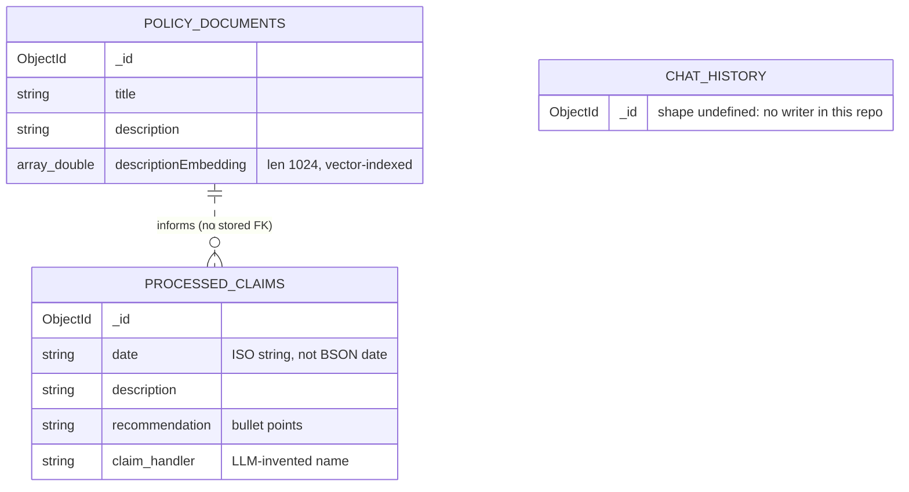

# EDD — Entity Document Diagram

Database: `insurance_claims` (env var `DATABASE_NAME`), on MongoDB Atlas. All clients
connect via `pymongo.MongoClient(MONGODB_URI, appName="devrel-github-python-insurance_agentic")`.

Field types below were derived from the code paths that write each collection
(`backend/scripts/seed_policy_documents.py`, `backend/agent_tools.py`,
`backend/main.py`) — this application defines no JSON Schema validators, so a document's
actual shape is whatever the writing code (or, for `processed_claims`, the LLM's tool
call) puts there.

## Entity overview

| Collection | Env var | Written by | Read by | Vector index |
| --- | --- | --- | --- | --- |
| `policy_documents` | `COLLECTION_NAME` | `backend/scripts/seed_policy_documents.py` | `fetch_guidelines` tool (`backend/agent_tools.py`) via `MongoDBAtlasVectorSearch` | `description_index` |
| `processed_claims` | `COLLECTION_NAME_2` | `persist_data` tool (`backend/agent_tools.py`), called by the agent | `POST /runAgent` (`backend/main.py`), by `_id` | none |
| `chat_history` | `CHAT_HISTORY_COLLECTION` | nothing found in this repo | `clean_chat_history` tool (`backend/agent_tools.py`), which only deletes | none |

## `policy_documents`

Seeded by `backend/scripts/seed_policy_documents.py` (five sample guideline documents)
and embedded with `cohere.embed-english-v3` via
`backend/embeddings/bedrock/getters.get_embedding_model`. Read at query time by the
`fetch_guidelines` tool, which runs `vector_store.similarity_search_with_score(query, k=n)`
against the `description_index` vector search index and returns the top hit's
`description`.

| Field | Type | Notes |
| --- | --- | --- |
| `_id` | ObjectId | Assigned by MongoDB on insert. |
| `title` | string | Short guideline name, e.g. `"Collision Damage Coverage"`. |
| `description` | string | The guideline text. This is the vector store's `text_key` — what `fetch_guidelines` returns as `page_content`. |
| `descriptionEmbedding` | array\<double\>, len=1024 | Embedding of `description`, produced by `cohere.embed-english-v3`. This is the vector store's `embedding_key` and the field the `description_index` vector search index is built on. |

### Vector search index: `description_index`

Created idempotently by `backend/scripts/create_vector_search_index.py`:

```json
{
  "name": "description_index",
  "type": "vectorSearch",
  "definition": {
    "fields": [
      {
        "path": "descriptionEmbedding",
        "type": "vector",
        "numDimensions": 1024,
        "similarity": "cosine"
      }
    ]
  }
}
```

`INDEX_NAME`, `VECTOR_FIELD` (`descriptionEmbedding`), and `DIMENSIONS` (`1024`) in that
script must match the constants hardcoded in `backend/agent_tools.py`
(`INDEX_NAME = "description_index"`) and the embedding model's output size
(`cohere.embed-english-v3` → 1024 dimensions). There is no code-level check that
enforces this agreement — changing one without the other breaks retrieval silently
(the search returns 0 or malformed results rather than raising).

## `processed_claims`

Written by the `persist_data` tool once per agent run, from a dict the LLM constructs
as a tool-call argument. The document's fields are dictated entirely by the system
prompt in `backend/agent_definition.py` (`create_agent`'s prompt string), not by any
schema in code — so this table documents what the agent is *instructed* to write, which
is only as reliable as the model's tool-call compliance.

| Field | Type | Notes |
| --- | --- | --- |
| `_id` | ObjectId | Assigned by MongoDB on insert. Returned to the caller as `object_id` (string) by `persist_data`, and used by `GET`-style lookup in `POST /runAgent` to fetch the document back. |
| `date` | string | Prompted as "the current date and time in iso format." Stored as a plain string, not a BSON date — no code parses or validates it. |
| `description` | string | Prompted as "a summary of the accident." |
| `recommendation` | string | Prompted as "the recommended course of action based on the retrieved guidelines," formatted as bullet points, with claim-adjuster mentions excluded per the prompt. |
| `claim_handler` | string | Prompted as "the name of the claim handler, make one up" — i.e. this field is a model-invented placeholder name, not a real handler record or foreign key into any handler collection. |

`POST /runAgent` (`backend/main.py`) reads this collection with
`collection.find_one({"_id": ObjectId(object_id)})` and returns the document with `_id`
stringified.

## `chat_history`

Referenced only by the `clean_chat_history` tool in `backend/agent_tools.py`, which runs
`collection.delete_many({})` on it at the end of every agent workflow (per the system
prompt's closing instruction in `backend/agent_definition.py`). No code path in this
repo inserts or updates documents in this collection — see *Known inconsistencies*.

| Field | Type | Notes |
| --- | --- | --- |
| _(none observed)_ | — | The collection exists only as a name (`CHAT_HISTORY_COLLECTION`) that gets cleared; no writer defines its document shape. |

## Relationships

All relationships are **logical only** — no foreign keys, no validators, no indexes
beyond `_id` on `processed_claims`/`chat_history` and the `description_index` vector
search index on `policy_documents`.

- An `insurance_agent()` run (`backend/insurance_agent.py`) reads zero or more
  `policy_documents` (via `fetch_guidelines`) to inform the `recommendation` text it
  writes into exactly one new `processed_claims` document (via `persist_data`), then
  clears `chat_history`.
- `processed_claims.recommendation` is derived from `policy_documents.description` at
  generation time; there is no stored reference (no guideline `_id`) linking a claim
  back to the guideline(s) that informed it.



## Known inconsistencies

1. **`chat_history` is cleared but never populated.** `pyproject.toml` depends on
   `langgraph-checkpoint-mongodb`, and the root `README.md` describes `chat_history` as
   "for agent conversation persistence," but no code in this repo constructs a
   `MongoDBSaver` (or any other writer) pointed at `CHAT_HISTORY_COLLECTION`. The
   `clean_chat_history` tool deletes from a collection that, as far as this codebase is
   concerned, is always already empty. If checkpointing is wired up later, update this
   entry and the `chat_history` table above with the real document shape.
2. **`processed_claims.date` is a free-text string, not a BSON date.** The system
   prompt asks the model for "the current date and time in iso format," but nothing
   converts or validates that string server-side, so `date` can drift in format or be
   omitted if the model doesn't comply. If this is tightened (e.g. the tool sets
   `datetime.now()` itself instead of trusting the model), update this row.
3. **No stored link between a `processed_claims` document and the `policy_documents`
   it was based on.** `fetch_guidelines` returns only guideline text to the LLM, not an
   `_id`; nothing in `persist_data`'s document captures which guideline(s) were
   retrieved. Auditing which policy justified a given recommendation requires re-running
   the search, not reading the stored claim. Update this entry if a guideline reference
   is added to the persisted schema.
