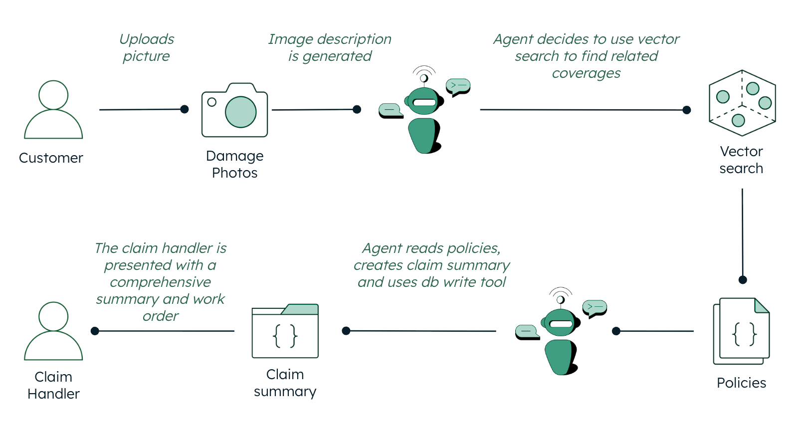

# Insurance Claim Handler AI Agent

An AI-powered insurance claims assistant that turns an uploaded accident photo into a
structured claim: it describes the damage with a Bedrock vision model, retrieves relevant
policy guidelines via MongoDB Vector Search, and has a LangGraph agent produce and
persist a claim summary with recommendations for a human handler.

## Where MongoDB Shines?

MongoDB Atlas stores the whole workflow in one place: structured claim documents, agent
chat history, and unstructured policy guideline text alongside its vector embeddings.
MongoDB Vector Search powers the guideline retrieval step — matching an AI-generated damage
description against policy documents by semantic similarity rather than keyword search.

## High Level Architecture



A customer uploads a damage photo → a Bedrock vision model describes it → a LangGraph
agent retrieves relevant policy guidelines from MongoDB via vector search → the agent
produces a claim summary with recommendations and persists it back to MongoDB.

## Tech Stack

- [FastAPI](https://fastapi.tiangolo.com/) + [Uvicorn](https://www.uvicorn.org/) for the backend API
- [LangChain](https://python.langchain.com/docs/) + [LangGraph](https://langchain-ai.github.io/langgraph/) for the agent
- [AWS Bedrock](https://aws.amazon.com/bedrock/) (Claude models) for image analysis and agent reasoning
- [MongoDB Atlas](https://www.mongodb.com/cloud/atlas/register?utm_campaign=devrel&utm_source=github&utm_medium=referral&utm_content=insurance_agentic&utm_term=learning.fuel) and [MongoDB Vector Search](https://www.mongodb.com/products/platform/atlas/vector-search?utm_campaign=devrel&utm_source=github&utm_medium=referral&utm_content=insurance_agentic&utm_term=learning.fuel) for storage and guideline retrieval
- [Next.js](https://nextjs.org/docs/app) (App Router) + [CSS Modules](https://github.com/css-modules/css-modules) for the frontend

## Prerequisites

Before you begin, ensure you have met the following requirements:

- Python 3.10 or higher (but less than 3.11)
- Node.js 18 or higher
- Poetry (install via [Poetry's official documentation](https://python-poetry.org/docs/#installation))
- An AWS account with Bedrock access and a MongoDB Atlas cluster

See the main [README.md](README.md) for full environment variable and setup details.

## Run it Locally

### Backend

1. Ensure you are in the root project directory where the `Makefile` is located.
2. Execute the following commands:
   - Configure Poetry to use an in-project virtualenv:
     ```bash
     make poetry_start
     ```
   - Install dependencies:
     ```bash
     make poetry_install
     ```
3. Verify that the `.venv` folder has been generated within the `/backend` directory.
4. Create the `backend/.env` file as described in the main [README.md](README.md), then
   start the server:
   ```bash
   cd backend
   poetry run uvicorn main:app --host 0.0.0.0 --port 8080
   ```

### Frontend

1. Navigate to the `frontend` folder.
2. Install dependencies by running:
   ```bash
   npm install
   ```
3. Create the `frontend/.env.local` file as described in the main [README.md](README.md).
4. Start the frontend development server with:
   ```bash
   npm run dev
   ```
5. The frontend will now be accessible at http://localhost:3000 by default, providing a user interface.

## Run with Docker

Make sure to run this on the root directory.

1. To run with Docker use the following command:
   ```bash
   make build
   ```
2. To delete the container and image run:
   ```bash
   make clean
   ```

## Common errors

### Backend

- Check that you've created a `backend/.env` file with your MongoDB connection string and AWS credentials — see the main [README.md](README.md) for the full list of required variables.

### Frontend

- Check that you've created a `frontend/.env.local` file with `NEXT_PUBLIC_API_BASE` pointing at the backend.
