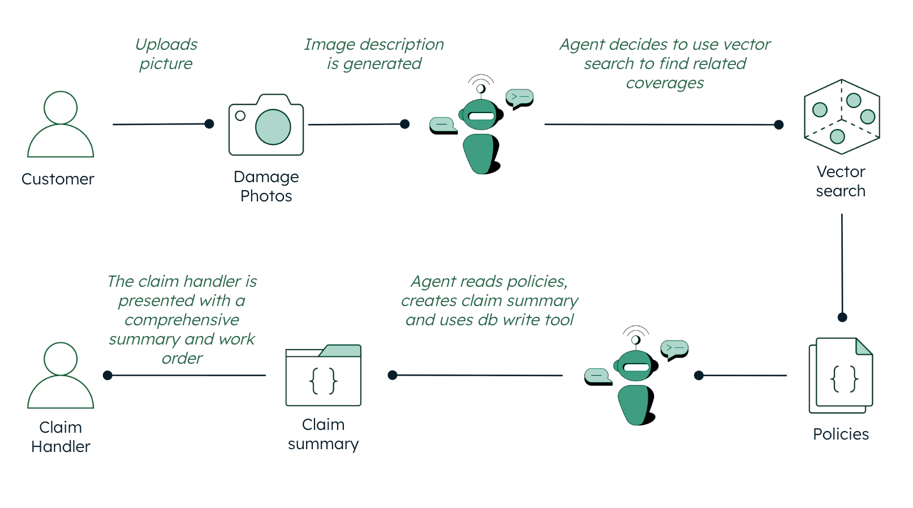

---

# Insurance Claim Handler AI Agent

## Overview

This project is an intelligent **AI-powered Insurance Claims Assistant** that streamlines the claim handling process through an automated agentic workflow. The system processes accident images uploaded by customers, generates AI-based damage descriptions, and triggers a sophisticated backend agent that retrieves relevant insurance policies using vector search to provide actionable claim recommendations to handlers.

---

## High-Level Architecture

  

The application follows a comprehensive agentic workflow that bridges structured and unstructured data:

1. **Customer Input:** Customers upload damage photos through a web interface  
2. **AI Image Analysis:** Advanced AI models analyze and describe accident damage in real-time  
3. **Intelligent Agent Processing:** [LangGraph](https://langchain-ai.github.io/langgraph/)-powered agent processes the description through multiple decision points  
4. **Vector-Based Policy Retrieval:** Agent uses semantic search to find relevant insurance guidelines  
5. **Automated Claim Processing:** Agent creates comprehensive claim summaries with structured recommendations  
6. **Handler Assignment:** System assigns claims to appropriate handlers with complete documentation

---

## Where MongoDB Shines

This project leverages [**MongoDB Atlas Vector Search**](https://www.mongodb.com/products/platform/atlas/vector-search) to efficiently handle the complete insurance workflow, providing fast and relevant retrieval of information. [MongoDB Atlas](https://www.mongodb.com/atlas/database) offers robust and scalable database solutions, making it ideal for handling large volumes of data and complex queries.

### Key MongoDB Capabilities

- **Unified Data Platform**  
  Seamlessly handles both structured claim data (customer info, policy details) and unstructured data (damage photos, policy documents, accident reports) in a single database. No more data silos or complex ETL processes.

- **[Atlas Vector Search](https://www.mongodb.com/products/platform/atlas/vector-search)**  
  Powers semantic similarity search using advanced embeddings to find relevant insurance policies based on accident descriptions, enabling intelligent claim routing and policy recommendations with unprecedented accuracy.

- **Flexible Schema Evolution**  
  Perfect for evolving agentic workflows where claim structures, agent tools, and processing steps continuously adapt to new regulations, products, and customer needs without database migrations.

- **Flexibility—Multi-modal Data Storage**  
  MongoDB provides unmatched flexibility in supporting multi-modal data. It efficiently stores and indexes diverse data types, including structured claim records, document-like policies, unstructured accident images, vector embeddings, and even time-series sensor data. This enables seamless workflows where all your data—optimized for AI/ML processing and real-time analytics—resides in a single, unified platform.

---

## Key Features

- **Guideline Retrieval:** Vector-based search for relevant insurance guidelines based on accident descriptions  
- **Persistent State Management:** Store claim data, chat history, and agent states in MongoDB with full audit trails  
- **Vector-Powered Policy Retrieval:** Semantic search through insurance guidelines using [Cohere embeddings](https://docs.cohere.com/docs/embeddings) with cosine similarity  
- **Flexible Data Storage:** MongoDB's document structure handles dynamic claim data and evolving workflows

---

## Tech Stack

### Backend Framework

- **[FastAPI](https://fastapi.tiangolo.com/):** Modern, high-performance web framework for building APIs  
- **[Uvicorn](https://www.uvicorn.org/):** ASGI web server for running FastAPI applications  
- **Python 3.10:** Core programming language (>=3.10,<3.11)

### AI/ML Stack

- **[LangChain](https://python.langchain.com/docs/):** Framework for developing applications with language models  
- **[LangGraph](https://langchain-ai.github.io/langgraph/):** Library for building stateful, multi-actor agentic applications  
- **[AWS Bedrock](https://aws.amazon.com/bedrock/):** Managed service for foundation models  
- **Claude 3 Haiku:** [anthropic.claude-3-haiku-20240307-v1:0](https://docs.anthropic.com/claude/docs/models-overview) – Fast agent orchestration and reasoning  
- **Claude 3 Sonnet:** [anthropic.claude-3-sonnet-20240229-v1:0](https://docs.anthropic.com/claude/docs/models-overview) – Advanced multi-modal image analysis  
- **Cohere English V3:** [cohere.embed-english-v3](https://docs.cohere.com/docs/embeddings) – Text embeddings for vector search

### Database & Vector Search

- **[MongoDB Atlas](https://www.mongodb.com/atlas/database):** Cloud-native document database with vector search capabilities  
- **[MongoDB Atlas Vector Search](https://www.mongodb.com/products/platform/atlas/vector-search):** Semantic similarity search for policy retrieval  
- **[PyMongo](https://pymongo.readthedocs.io/en/stable/):** Python driver for MongoDB operations  
- **[LangGraph MongoDB Checkpoint](https://langchain-ai.github.io/langgraph/integrations/mongodb_checkpoint/):** Agent state persistence and workflow tracking

### Frontend

- **[Next.js](https://nextjs.org/):** React framework with server-side rendering  
- **[React](https://reactjs.org/):** Frontend JavaScript library  
- **[CSS Modules](https://github.com/css-modules/css-modules):** Scoped component styling

### Containerization & Deployment

- **[Docker](https://www.docker.com/):** Container platform for consistent deployments  
- **[Docker Compose](https://docs.docker.com/compose/):** Multi-container application orchestration  
- **[Poetry](https://python-poetry.org/):** Python dependency management and packaging  
- **[Make](https://www.gnu.org/software/make/):** Build automation and deployment commands

---

## Setup Instructions

### Step 0: Set Up MongoDB Database and Collections

1. Log in to [MongoDB Atlas](https://www.mongodb.com/atlas/database) and create a new database named `insurance_claims`
2. Create the following collections:  
    - `processed_claims` – For storing final claim summaries  
    - `chat_history` – For agent conversation persistence  
    - `policy_documents` – For insurance guidelines and policies (with vector embeddings)
3. **Set up MongoDB Vector Search Index for the `policy_documents` collection:**

```json
{
  "fields": [
    {
      "type": "vector",
      "path": "descriptionEmbedding",
      "numDimensions": 1024,
      "similarity": "cosine"
    }
  ]
}
```

---

### Step 1: Configure AWS Account

- Create an [AWS account](https://portal.aws.amazon.com/billing/signup) if you don't have one  
- Add the AWS Access Key ID and Secret Access Key to your environment variables  
- Grant the necessary permissions to the AWS account: `AmazonBedrockFullAccess`  
- Ensure the required [Bedrock models](https://docs.aws.amazon.com/bedrock/latest/userguide/foundation-models.html) are available in your region:  
    - `anthropic.claude-3-haiku-20240307-v1:0` (for agent orchestration)  
    - `anthropic.claude-3-sonnet-20240229-v1:0` (for image analysis)  
    - `cohere.embed-english-v3` (for text embeddings)  

---

## Run with Docker (Recommended)

### Prerequisites
- [Docker Desktop](https://www.docker.com/products/docker-desktop/) installed and running on your machine  
- [`make`](https://www.gnu.org/software/make/) installed (`sudo apt install make` on Ubuntu or `brew install make` on macOS)

### Docker Setup Instructions

Clone the repository:

```sh
git clone <repo-url>
cd insurance-claim-agent
```

#### Configure Environment Variables

Create a `.env` file in the root directory:

```dotenv
# AWS Configuration
AWS_DEFAULT_REGION=us-east-1

# MongoDB Configuration
MONGODB_URI=""
DATABASE_NAME=insurance_claims
COLLECTION_NAME=policy_documents
COLLECTION_NAME_2=processed_claims
CHAT_HISTORY_COLLECTION=chat_history

# Bedrock Configuration
BEDROCK_REGION=us-east-1

# Frontend Configuration
NEXT_PUBLIC_IMAGE_DESCRIPTOR_API_URL=http://localhost:8000/imageDescriptor
NEXT_PUBLIC_RUN_AGENT_API_URL=http://localhost:8000/runAgent
```

#### Build the Application

```sh
make build
```

#### Access the Application

- Frontend UI: [http://localhost:3000](http://localhost:3000)
- Backend API: [http://localhost:8000](http://localhost:8000)
- API Documentation: [http://localhost:8000/docs](http://localhost:8000/docs)

---

### Docker Management Commands

Start services (if already built):

```sh
make start
```

Stop all services:

```sh
make stop
```

View logs:

```sh
docker-compose logs -f
```

Clean up containers and images:

```sh
make clean
```

---

## Run Locally (Development)

### Backend Setup

Clone the repository:

```sh
git clone <repo-url>
cd insurance-claim-agent/backend
```

Install Poetry (if not already installed):

```sh
make install_poetry
```

Configure Poetry and install dependencies:

```sh
poetry install
```

#### Configure Environment Variables

Create a `.env` file in the `backend` directory:

```dotenv
# AWS Configuration
AWS_DEFAULT_REGION=us-east-1

# MongoDB Configuration
MONGODB_URI=""
DATABASE_NAME=insurance_claims
COLLECTION_NAME=policy_documents
COLLECTION_NAME_2=processed_claims
CHAT_HISTORY_COLLECTION=chat_history

# Bedrock Configuration
BEDROCK_REGION=us-east-1
```

Start the backend server.

### Frontend Setup

Open a new terminal and navigate to `frontend`:

```sh
cd ../frontend  # or 'cd frontend' if starting from project root
```

#### Configure Frontend Environment Variables

Create a `.env.local` file in the `frontend` directory:

```dotenv
NEXT_PUBLIC_IMAGE_DESCRIPTOR_API_URL=http://localhost:8000/imageDescriptor
NEXT_PUBLIC_RUN_AGENT_API_URL=http://localhost:8000/runAgent
```

Install dependencies:

```sh
npm install
```

Start the frontend development server:

```sh
npm run dev
```

#### Access Local Development

- Frontend UI: [http://localhost:3000](http://localhost:3000)
- Backend API: [http://localhost:8000](http://localhost:8000)
- API Documentation: [http://localhost:8000/docs](http://localhost:8000/docs)

---

## Troubleshooting

### Common Issues

#### Poetry Installation Issues

If you get package installation errors, use:

```sh
poetry install --no-root
```

#### Makefile Assistance

The provided Makefile streamlines common setup and development tasks. If you encounter issues with setting up Poetry, Docker containers, or running the application, try using the provided make commands, such as:

- `make install_poetry` – Installs Poetry for dependency management  
- `make build` – Builds Docker images for backend and frontend  
- `make start` / `make stop` – Starts or stops the full stack using Docker Compose  
- `make clean` – Cleans up containers and images to resolve potential environment conflicts  

Refer to the Makefile itself or run `make help` for a full list and description of available commands.

#### Docker Issues

- Ensure Docker Desktop is running before using Make commands
- Check that AWS credentials are properly mounted in containers
- Verify that ports `3000` and `8000` are not in use by other applications

#### AWS Bedrock Access

- Ensure your AWS credentials have Bedrock permissions for all three models
- Verify Claude and Cohere models are available in your specified region
- Check that your AWS account has been granted access to required models

#### MongoDB Connection

- Verify your MongoDB URI format and network connectivity
- Ensure all required collections (`processed_claims`, `chat_history`, `policy_documents`) exist
- Check that your Vector Search index is properly configured with correct field names

#### Environment Variables

- Ensure `.env` files are in the correct directories
- Verify all required environment variables are set
- Check that sensitive values are properly configured (no placeholder text)

---